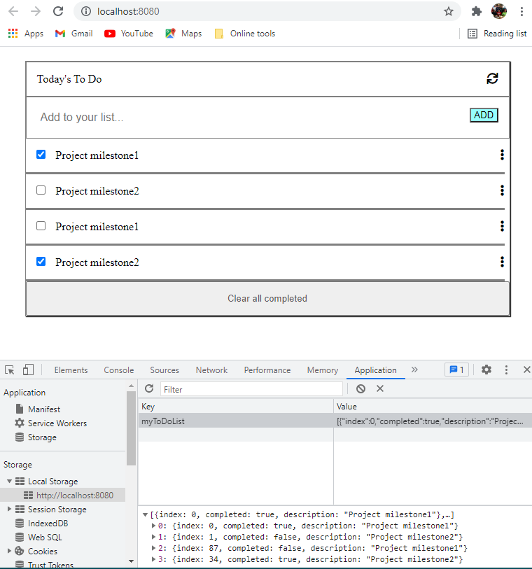

## To-do-list ##

> The project's goal is to learn how to use webpack. "To-do list" is a tool that helps to organize your day. It simply lists the things that you need to do and allows you to mark them as complete. You will build a simple website that allows for doing that, and you will do it using ES6 and Webpack!

Additional description about the project and its features.

## Built With

- HTML, CSS, JS
- Linterns, Git
- Flexbox, Webpack

## Getting Started

### Prerequisites
You will need an up to date browser to render your To Do List. Also npm to run terminal commands.

### Setup and Install
To get a local copy up and running follow these simple example steps. You can either download the zip file, or clone the repository from [here](https://github.com/herokudev/to-do-list/tree/List-structure) 

### Usage
To test the app locally, use Live Server (Extension for VS Code)

## Authors (Github: Herokudev)
Herbert Orellana

- GitHub: [@herokudev](https://github.com/herokudev)
- LinkedIn: [LinkedIn](https://linkedin.com/in/armando-orellana-a0b50b34)

## 🤝 Contributing
Contributions, issues, and feature requests are welcome!

Show your support
Give a ⭐️ if you like this project!

## 📝 License 
This project is MIT licensed.